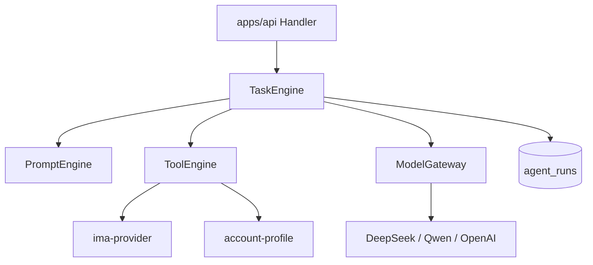

# Agent Runtime 设计文档 V1

## 一、定位

自研 TypeScript Runtime，替代 Dify / FastGPT。业务层只通过 `packages/ai-runtime` 调用，不直连大模型 SDK。

```
apps/api
    ↓
packages/ai-runtime
    ├── TaskEngine
    ├── PromptEngine
    ├── ToolEngine
    └── ModelGateway
    ↓
packages/db (agent_runs)
```

## 二、整体架构



## 三、Task Engine

### 3.1 职责

- 创建并执行一次 Agent 任务
- 维护 `RunStatus` 状态机
- 写入 `agent_runs`（input / output / error / 时间）
- 串联 PromptEngine → ToolEngine → ModelGateway

### 3.2 状态机

```text
PENDING → RUNNING → SUCCESS
                 ↘ FAILED
```

| 状态 | 含义 | 触发 |
| ---- | ---- | ---- |
| PENDING | 已创建未执行 | `createRun()` |
| RUNNING | 执行中 | `execute()` 开始 |
| SUCCESS | 完成 | 模型返回且解析成功 |
| FAILED | 失败 | 异常、超时、校验失败 |

### 3.3 核心接口

```ts
interface TaskEngine {
  run(input: RunAgentInput): Promise<AgentRunResult>
}

interface RunAgentInput {
  agentId?: string
  agentType: AgentType
  contentId: string
  versionId?: string
  accountId?: string
  overrides?: {
    model?: string
    promptVersion?: string
    variables?: Record<string, string>
  }
}

interface AgentRunResult {
  runId: string
  status: RunStatus
  output: unknown
}
```

### 3.4 执行序列（单次 Run）

```text
1. 加载 Agent + Prompt（agents / prompts 表）
2. insert agent_runs status=PENDING
3. update status=RUNNING
4. ToolEngine.buildContext() → 变量
5. PromptEngine.render(template, variables)
6. ModelGateway.chat(messages)
7. parseOutput(agentType, rawText) → structured output
8. update agent_runs SUCCESS + output + finishedAt
9. 可选：回写 contents / content_versions
```

### 3.5 与数据表映射

| agent_runs 字段 | 来源 |
| --------------- | ---- |
| agentId | agents.id |
| contentId | 入参 |
| versionId | 入参（改写类必填） |
| input | RunAgentInput 序列化 |
| output | parseOutput 结果 |
| model | agents.model 或 overrides |
| promptVersion | prompts.version |
| status / error | TaskEngine |
| startedAt / finishedAt | 执行时间 |

## 四、Prompt Engine

### 4.1 职责

- 按 `promptId` 或 `agentType` 加载启用中的 Prompt
- 变量替换：`{{topic}}`、`{{accountStyle}}` 等
- 支持版本：`标题Agent V1/V2/V3` 对应 `prompts.version`

### 4.2 变量来源

| 变量 | 来源 |
| ---- | ---- |
| topicTitle, topicDesc | topics + contents |
| title, body, summary | contents |
| accountProfile | account_profiles |
| platformRules | system_configs 或内置 JSON |
| imaSummary | 最近一条 ima_search_logs.resultSummary |
| platform, tags | content_versions |

### 4.3 接口

```ts
interface PromptEngine {
  render(input: {
    template: string
    variables: Record<string, string>
  }): string

  loadForAgent(agentId: string): Promise<{
    template: string
    version: string
    variables: Record<string, string>
  }>
}
```

### 4.4 渲染规则

- 缺失变量：替换为空字符串，并写 WARN 日志
- 禁用词：渲染后由 Review Tool 二次扫描，不在 PromptEngine 硬编码

## 五、Tool Engine

### 5.1 内置 Tool

| Tool | 说明 | 第一阶段 |
| ---- | ---- | -------- |
| imaSearch | 调用 IMA，写 ima_search_logs | ✓ |
| loadAccountProfile | 读 account_profiles | ✓ |
| loadContentContext | 读 content + topic | ✓ |
| loadPlatformRules | 按 Platform 返回规则文本 | ✓ |
| reviewRulesCheck | 敏感词 / AIGC / 格式规则（规则表） | ✓ |

### 5.2 接口

```ts
interface ToolEngine {
  buildContext(input: RunAgentInput): Promise<Record<string, string>>
  invoke<T>(tool: ToolName, params: unknown): Promise<T>
}

type ToolName =
  | 'ima.search'
  | 'profile.load'
  | 'content.load'
  | 'rules.platform'
  | 'rules.review'
```

### 5.3 IMA 调用约定

- 由 `packages/ima-provider` 实现 `KnowledgeProvider`
- ToolEngine 只依赖接口，不依赖 IMA SDK 细节

## 六、Model Gateway

### 6.1 职责

- 统一 `chat()` 入口
- 屏蔽 DeepSeek / Qwen / OpenAI / Claude 差异
- 记录 token usage（写入 agent_runs.output.meta）

### 6.2 接口

```ts
interface ModelGateway {
  chat(input: ChatInput): Promise<ChatOutput>
}

interface ChatInput {
  provider: 'deepseek' | 'qwen' | 'openai' | 'claude'
  model: string
  messages: Array<{ role: 'system' | 'user' | 'assistant'; content: string }>
  temperature?: number
  maxTokens?: number
}

interface ChatOutput {
  content: string
  usage?: { inputTokens: number; outputTokens: number }
  raw?: unknown
}
```

### 6.3 配置

- Provider 与 API Key 存 `system_configs`
- 默认：`deepseek` + `deepseek-chat`
- 切换模型：只改 `agents.model` 或 `system_configs`，业务代码不变

### 6.4 错误与重试

| 错误 | 策略 |
| ---- | ---- |
| 429 / 5xx | 最多重试 2 次，指数退避 |
| 401 | 立即 FAILED，提示配置 Key |
| 超时 60s | FAILED |

## 七、第一阶段 Agent 清单

| AgentType | 名称 | 输入 | 输出 | 回写 |
| --------- | ---- | ---- | ---- | ---- |
| TITLE | 标题 Agent | contentId, accountId | titles[] | contents.title 候选 |
| BODY | 正文 Agent | contentId, imaSummary | body markdown | contents.body |
| TAG | 标签 Agent | versionId | tags[] | content_versions.tags |
| REWRITE | 平台改写 | contentId, platform, accountId | title, body, coverText | content_versions |
| REVIEW | 审核辅助 | versionId | checks[], riskLevel | 仅 output，不改状态 |
| SUMMARY | 复盘 Agent | contentId | summary, insights | analytics_reports |

编排接口 `POST /contents/:id/generate` 默认顺序：

```text
ima.search → title → body → rewrite(按平台) → 状态 pending_review
```

## 八、输出解析（parseOutput）

每种 `AgentType` 约定 JSON 输出，模型不符合时 FAILED：

```json
// TITLE
{ "titles": ["标题1", "标题2"] }

// REWRITE
{ "title": "", "body": "", "coverText": "", "tags": [] }

// REVIEW
{ "passed": false, "checks": [{ "name": "敏感词", "ok": false, "detail": "" }] }
```

实现：`packages/ai-runtime/src/parsers/*.ts`，可用 zod 校验。

## 九、与 API 的关系

| API | Runtime 调用 |
| --- | ------------ |
| POST /agents/title/run | TaskEngine.run({ agentType: TITLE }) |
| POST /contents/:id/generate | 编排多个 run，事务外串行 |
| GET /agent-runs | 直接查库 |

## 十、目录结构（实现参考）

```text
packages/ai-runtime/
  src/
    index.ts
    task-engine.ts
    prompt-engine.ts
    tool-engine.ts
    model-gateway/
      index.ts
      deepseek.ts
      qwen.ts
    parsers/
      title.ts
      rewrite.ts
      review.ts
    types.ts
```

## 十一、非 MVP（记录备查）

- 异步队列、长任务 WebSocket 推送
- 多步 Workflow DAG
- 外部 Agent Webhook 回调

相关文档：《数据库设计文档 V1》《API设计文档 V1》《TurboPush 二开方案 V1》
