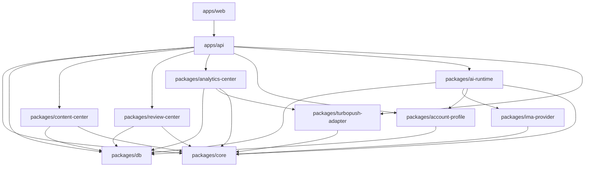

# 基于 TurboPush 改造的 AI 内容运营中台详细设计文档 V1

## 一、项目定位

本项目基于 TurboPush 开源项目进行二次开发，在原有多平台账号管理、内容编辑、发布管理和数据同步能力基础上，新增 AI 内容运营全流程能力。

目标不是重新开发一个系统，而是在 TurboPush 基础上增强以下能力：

- 内容资产管理
- 多平台版本管理
- 账号画像管理
- Agent Runtime
- Prompt 管理
- 审核流
- IMA 搜索接入
- 发布前治理
- 发布后数据复盘

最终形成：

> 选题 → 搜索参考 → AI 生成 → 多平台改写 → 人工审核 → 发布 → 数据回收 → 复盘报告

的完整内容运营闭环。

------

## 二、总体架构设计

### 系统架构

```text
用户 / 运营人员
    ↓
TurboPush Web Console
    ↓
TurboPush Core
    ├── 用户与权限
    ├── 团队管理
    ├── 平台账号管理
    ├── 内容编辑器
    ├── 发布管理
    ├── 平台适配器
    └── 数据同步

新增 AI 内容运营模块
    ├── 内容资产中心
    ├── 多平台版本中心
    ├── 账号画像中心
    ├── Agent Runtime
    ├── Prompt 管理中心
    ├── 审核中心
    ├── IMA 搜索接入层
    └── 数据复盘中心

外部能力
    ├── IMA 搜索
    ├── 大模型 API
    └── 外部内容平台
        ├── 微信公众号
        ├── 小红书
        ├── 抖音
        ├── 视频号
        ├── B站
        └── 知乎

本地数据
    └── SQLite
```

------

## 三、技术选型

| 模块       | 技术                                         |
| ---------- | -------------------------------------------- |
| 前端       | Next.js + React + TypeScript                 |
| 后端       | Node.js + TypeScript                         |
| 数据库     | SQLite                                       |
| ORM        | Prisma                                       |
| UI 组件    | Tailwind CSS / shadcn/ui / Ant Design 二选一 |
| AI Runtime | 自研 TypeScript Runtime                      |
| 知识搜索   | IMA                                          |
| 发布底座   | TurboPush 原有发布能力                       |
| 部署       | 单机 Docker / Node 直接部署                  |

第一阶段不引入：

- Redis
- MinIO
- Elasticsearch
- pgvector
- n8n
- Dify
- FastGPT
- 独立对象存储
- 独立工作流引擎

------

## 四、模块解耦设计

### 模块分层

```text
apps/web
    前端页面与交互

apps/api
    后端 API 服务

packages/core
    通用类型、枚举、工具函数

packages/db
    Prisma Schema、数据库访问层

packages/turbopush-adapter
    对 TurboPush 原有发布能力的封装

packages/ai-runtime
    Agent Runtime、Prompt Engine、Model Gateway

packages/ima-provider
    IMA 搜索能力封装

packages/content-center
    内容资产、平台版本、素材引用

packages/review-center
    审核流、状态机、审核记录

packages/analytics-center
    数据复盘、指标分析、复盘报告

packages/account-profile
    平台账号画像、账号风格、账号规则
```

### 解耦原则

1. **TurboPush 原能力不直接魔改核心逻辑**
   通过 `turbopush-adapter` 包封装发布、账号、数据同步能力。
2. **AI Runtime 不直接依赖页面**
   前端只调用 API，API 再调用 Runtime。
3. **IMA 只作为搜索 Provider**
   不在系统内做知识库，不维护向量库。
4. **发布和内容生成解耦**
   内容先生成和审核，审核通过后才进入 TurboPush 发布流程。
5. **账号画像和平台账号解耦**
   TurboPush 管账号授权，新增模块管账号风格、内容边界和运营策略。

### 模块依赖图



依赖规则：`apps/*` 不互相依赖；`packages/*` 禁止循环依赖；仅 `turbopush-adapter` 可引用 TurboPush 上游代码。

### 配套文档索引

| 主题 | 文档 |
| ---- | ---- |
| 数据库 / Prisma | [数据库设计文档 V1.md](./数据库设计文档%20V1.md) |
| API / OpenAPI | [API设计文档 V1.md](./API设计文档%20V1.md)、[openapi.yaml](./openapi.yaml) |
| 页面低保真 | [页面原型文档 V1.md](./页面原型文档%20V1.md) |
| 权限 RBAC | [权限模型 V1.md](./权限模型%20V1.md) |
| Agent Runtime | [Agent Runtime 设计文档 V1.md](./Agent%20Runtime%20设计文档%20V1.md) |
| TurboPush 二开 | [TurboPush 二开方案 V1.md](./TurboPush%20二开方案%20V1.md) |
| 开发规范 / 排期 | [开发规范文档 V1.md](./开发规范文档%20V1.md)、[开发排期 V1.md](./开发排期%20V1.md) |

------

## 五、核心业务流程

### 内容生产流程

```text
创建选题
    ↓
选择目标平台账号
    ↓
调用 IMA 搜索参考内容
    ↓
Agent Runtime 生成内容
    ↓
生成多平台版本
    ↓
进入待审核
    ↓
人工修改 / 驳回 / 通过
    ↓
同步到 TurboPush 发布
    ↓
发布后回收数据
    ↓
生成复盘报告
```

### 审核状态机

```text
draft              草稿
pending_generate   待生成
generating         生成中
pending_review     待审核
rejected           已驳回
approved           审核通过
pending_publish    待发布
publishing         发布中
published          已发布
failed             发布失败
reviewed           已复盘
archived           已归档
```

------

## 六、数据库设计 SQLite

### users 用户表

| 字段       | 类型     | 说明     |
| ---------- | -------- | -------- |
| id         | text     | 用户 ID  |
| name       | text     | 用户名称 |
| email      | text     | 邮箱     |
| role       | text     | 角色     |
| created_at | datetime | 创建时间 |
| updated_at | datetime | 更新时间 |

------

### platform_accounts 平台账号表

复用 TurboPush 原有账号表。如果原表字段不足，新增扩展表，不直接破坏原表结构。

字段建议：

| 字段         | 类型     | 说明                                         |
| ------------ | -------- | -------------------------------------------- |
| id           | text     | 账号 ID                                      |
| platform     | text     | 平台：wechat/xhs/douyin/video/bilibili/zhihu |
| account_name | text     | 账号名称                                     |
| account_type | text     | 账号类型                                     |
| auth_status  | text     | 授权状态                                     |
| owner_id     | text     | 负责人                                       |
| raw_data     | text     | 原平台账号信息 JSON                          |
| created_at   | datetime | 创建时间                                     |
| updated_at   | datetime | 更新时间                                     |

------

### account_profiles 账号画像表

| 字段             | 类型     | 说明          |
| ---------------- | -------- | ------------- |
| id               | text     | 画像 ID       |
| account_id       | text     | 平台账号 ID   |
| positioning      | text     | 账号定位      |
| target_audience  | text     | 目标用户 JSON |
| content_style    | text     | 内容风格      |
| title_preference | text     | 标题偏好      |
| cover_preference | text     | 封面偏好      |
| tone             | text     | 语气风格      |
| forbidden_words  | text     | 禁用词 JSON   |
| content_boundary | text     | 内容边界      |
| publish_strategy | text     | 发布策略      |
| created_at       | datetime | 创建时间      |
| updated_at       | datetime | 更新时间      |

------

### topics 选题表

| 字段             | 类型     | 说明                    |
| ---------------- | -------- | ----------------------- |
| id               | text     | 选题 ID                 |
| title            | text     | 选题名称                |
| description      | text     | 选题说明                |
| source           | text     | 来源：manual/ima/import |
| target_platforms | text     | 目标平台 JSON           |
| status           | text     | 状态                    |
| owner_id         | text     | 创建人                  |
| created_at       | datetime | 创建时间                |
| updated_at       | datetime | 更新时间                |

------

### contents 内容项目表

| 字段         | 类型     | 说明         |
| ------------ | -------- | ------------ |
| id           | text     | 内容 ID      |
| topic_id     | text     | 选题 ID      |
| title        | text     | 主标题       |
| summary      | text     | 内容摘要     |
| body         | text     | 主体内容     |
| cover_text   | text     | 封面文案     |
| status       | text     | 内容状态     |
| ai_generated | integer  | 是否 AI 生成 |
| created_by   | text     | 创建人       |
| created_at   | datetime | 创建时间     |
| updated_at   | datetime | 更新时间     |

------

### content_versions 平台版本表

| 字段          | 类型     | 说明              |
| ------------- | -------- | ----------------- |
| id            | text     | 版本 ID           |
| content_id    | text     | 内容 ID           |
| platform      | text     | 平台              |
| account_id    | text     | 平台账号 ID       |
| title         | text     | 平台标题          |
| body          | text     | 平台正文          |
| cover_text    | text     | 封面文案          |
| tags          | text     | 标签 JSON         |
| format_config | text     | 平台格式配置 JSON |
| status        | text     | 状态              |
| created_at    | datetime | 创建时间          |
| updated_at    | datetime | 更新时间          |

------

### materials 素材表

第一阶段不做对象存储，只保存本地路径或外链。

| 字段       | 类型     | 说明                   |
| ---------- | -------- | ---------------------- |
| id         | text     | 素材 ID                |
| content_id | text     | 内容 ID                |
| type       | text     | image/video/audio/file |
| name       | text     | 素材名称               |
| url        | text     | 外链或本地路径         |
| local_path | text     | 本地路径               |
| source     | text     | 来源                   |
| meta       | text     | 元数据 JSON            |
| created_at | datetime | 创建时间               |

------

### prompts Prompt 模板表

| 字段       | 类型     | 说明        |
| ---------- | -------- | ----------- |
| id         | text     | Prompt ID   |
| name       | text     | 名称        |
| agent_type | text     | Agent 类型  |
| version    | text     | 版本号      |
| template   | text     | Prompt 模板 |
| variables  | text     | 变量 JSON   |
| enabled    | integer  | 是否启用    |
| created_at | datetime | 创建时间    |
| updated_at | datetime | 更新时间    |

------

### agents Agent 配置表

| 字段        | 类型     | 说明                                  |
| ----------- | -------- | ------------------------------------- |
| id          | text     | Agent ID                              |
| name        | text     | Agent 名称                            |
| type        | text     | title/tag/rewrite/review/body/summary |
| description | text     | 说明                                  |
| prompt_id   | text     | 默认 Prompt                           |
| model       | text     | 默认模型                              |
| enabled     | integer  | 是否启用                              |
| config      | text     | 配置 JSON                             |
| created_at  | datetime | 创建时间                              |
| updated_at  | datetime | 更新时间                              |

------

### agent_runs Agent 执行记录表

| 字段           | 类型     | 说明                   |
| -------------- | -------- | ---------------------- |
| id             | text     | 执行 ID                |
| agent_id       | text     | Agent ID               |
| content_id     | text     | 内容 ID                |
| version_id     | text     | 平台版本 ID            |
| input          | text     | 输入 JSON              |
| output         | text     | 输出 JSON              |
| model          | text     | 使用模型               |
| prompt_version | text     | Prompt 版本            |
| status         | text     | running/success/failed |
| error          | text     | 错误信息               |
| started_at     | datetime | 开始时间               |
| finished_at    | datetime | 结束时间               |

------

### ima_search_logs IMA 搜索记录表

| 字段           | 类型     | 说明          |
| -------------- | -------- | ------------- |
| id             | text     | 记录 ID       |
| content_id     | text     | 内容 ID       |
| query          | text     | 搜索词        |
| result_summary | text     | 搜索结果摘要  |
| raw_result     | text     | 原始结果 JSON |
| created_at     | datetime | 创建时间      |

------

### review_tasks 审核任务表

| 字段        | 类型     | 说明                      |
| ----------- | -------- | ------------------------- |
| id          | text     | 审核任务 ID               |
| content_id  | text     | 内容 ID                   |
| version_id  | text     | 版本 ID                   |
| status      | text     | pending/approved/rejected |
| reviewer_id | text     | 审核人                    |
| comment     | text     | 审核意见                  |
| created_at  | datetime | 创建时间                  |
| reviewed_at | datetime | 审核时间                  |

------

### publishing_tasks 发布任务表

| 字段         | 类型     | 说明                              |
| ------------ | -------- | --------------------------------- |
| id           | text     | 发布任务 ID                       |
| content_id   | text     | 内容 ID                           |
| version_id   | text     | 版本 ID                           |
| account_id   | text     | 发布账号                          |
| platform     | text     | 平台                              |
| status       | text     | pending/publishing/success/failed |
| scheduled_at | datetime | 定时发布时间                      |
| published_at | datetime | 实际发布时间                      |
| error        | text     | 错误信息                          |
| created_at   | datetime | 创建时间                          |

------

### publish_records 发布记录表

| 字段             | 类型     | 说明            |
| ---------------- | -------- | --------------- |
| id               | text     | 发布记录 ID     |
| task_id          | text     | 发布任务 ID     |
| platform         | text     | 平台            |
| account_id       | text     | 账号 ID         |
| external_post_id | text     | 外部平台内容 ID |
| external_url     | text     | 外部链接        |
| status           | text     | 状态            |
| raw_result       | text     | 原始结果 JSON   |
| created_at       | datetime | 创建时间        |

------

### analytics_data 数据指标表

| 字段              | 类型     | 说明          |
| ----------------- | -------- | ------------- |
| id                | text     | 数据 ID       |
| publish_record_id | text     | 发布记录 ID   |
| content_id        | text     | 内容 ID       |
| version_id        | text     | 版本 ID       |
| platform          | text     | 平台          |
| account_id        | text     | 账号 ID       |
| views             | integer  | 阅读/播放     |
| likes             | integer  | 点赞          |
| comments          | integer  | 评论          |
| shares            | integer  | 分享          |
| collects          | integer  | 收藏          |
| followers_delta   | integer  | 粉丝变化      |
| raw_data          | text     | 原始数据 JSON |
| collected_at      | datetime | 采集时间      |

------

### analytics_reports 复盘报告表

| 字段             | 类型     | 说明                     |
| ---------------- | -------- | ------------------------ |
| id               | text     | 报告 ID                  |
| content_id       | text     | 内容 ID                  |
| report_type      | text     | content/account/platform |
| summary          | text     | 总结                     |
| insights         | text     | 洞察 JSON                |
| suggestions      | text     | 建议 JSON                |
| created_by_agent | integer  | 是否 AI 生成             |
| created_at       | datetime | 创建时间                 |

------

## 七、核心接口设计

> **实施标准**已迁移至 [API设计文档 V1.md](./API设计文档%20V1.md) 与 [openapi.yaml](./openapi.yaml)。下文保留示例供阅读业务流程，联调以 OpenAPI 为准。

### 内容资产接口

#### 创建选题

```http
POST /api/topics
```

请求：

```json
{
  "title": "AI内容运营平台选题",
  "description": "分析内容运营中台的产品机会",
  "targetPlatforms": ["wechat", "xiaohongshu", "douyin"]
}
```

------

#### 创建内容项目

```http
POST /api/contents
```

请求：

```json
{
  "topicId": "topic_001",
  "title": "AI内容运营中台方案",
  "summary": "用于生成多平台内容版本"
}
```

------

#### 获取内容详情

```http
GET /api/contents/:id
```

------

#### 更新内容

```http
PATCH /api/contents/:id
```

------

### 多平台版本接口

#### 生成平台版本

```http
POST /api/contents/:id/versions/generate
```

请求：

```json
{
  "platforms": ["wechat", "xiaohongshu", "douyin"],
  "accountIds": ["acc_001", "acc_002"]
}
```

------

#### 获取内容版本列表

```http
GET /api/contents/:id/versions
```

------

#### 更新平台版本

```http
PATCH /api/versions/:versionId
```

------

### Agent Runtime 接口

#### 运行标题 Agent

```http
POST /api/agents/title/run
```

请求：

```json
{
  "contentId": "content_001",
  "accountId": "account_001",
  "count": 5
}
```

------

#### 运行平台改写 Agent

```http
POST /api/agents/rewrite/run
```

请求：

```json
{
  "contentId": "content_001",
  "platform": "xiaohongshu",
  "accountId": "account_002"
}
```

------

#### 运行审核 Agent

```http
POST /api/agents/review/run
```

请求：

```json
{
  "versionId": "version_001"
}
```

------

#### 获取 Agent 执行记录

```http
GET /api/agent-runs?contentId=content_001
```

------

### IMA 搜索接口

#### 搜索参考内容

```http
POST /api/ima/search
```

请求：

```json
{
  "query": "小红书 AI 内容运营 爆款标题",
  "contentId": "content_001"
}
```

返回：

```json
{
  "items": [
    {
      "title": "参考标题",
      "summary": "参考摘要",
      "url": "https://example.com"
    }
  ]
}
```

------

### 审核接口

#### 提交审核

```http
POST /api/reviews
```

请求：

```json
{
  "contentId": "content_001",
  "versionId": "version_001"
}
```

------

#### 审核通过

```http
POST /api/reviews/:id/approve
```

------

#### 审核驳回

```http
POST /api/reviews/:id/reject
```

请求：

```json
{
  "comment": "标题不符合账号风格，需要重新生成"
}
```

------

### 发布接口

#### 创建发布任务

```http
POST /api/publishing/tasks
```

请求：

```json
{
  "versionId": "version_001",
  "accountId": "account_001",
  "scheduledAt": null
}
```

------

#### 调用 TurboPush 发布

```http
POST /api/publishing/tasks/:id/publish
```

------

#### 获取发布状态

```http
GET /api/publishing/tasks/:id
```

------

### 数据复盘接口

#### 同步平台数据

```http
POST /api/analytics/sync
```

请求：

```json
{
  "publishRecordId": "pub_001"
}
```

------

#### 生成复盘报告

```http
POST /api/analytics/reports/generate
```

请求：

```json
{
  "contentId": "content_001"
}
```

------

#### 查看复盘报告

```http
GET /api/analytics/reports/:id
```

------

## 八、Agent Runtime 设计

### Runtime 组成

```text
Agent Runtime
    ├── Task Engine
    ├── Prompt Engine
    ├── Tool Engine
    └── Model Gateway
```

### Task Engine

职责：

- 创建执行任务
- 记录执行状态
- 写入 agent_runs
- 捕获错误
- 返回结构化结果

------

### Prompt Engine

职责：

- 读取 Prompt 模板
- 注入变量
- 拼接账号画像
- 拼接平台规则
- 拼接 IMA 搜索摘要

------

### Tool Engine

职责：

- 调用 IMA 搜索
- 读取账号画像
- 读取内容上下文
- 调用平台规则工具
- 调用审核规则工具

------

### Model Gateway

职责：

- 统一调用大模型
- 屏蔽模型差异
- 后续支持切换 OpenAI、DeepSeek、Qwen 等

示例：

```ts
interface ModelGateway {
  chat(input: {
    model: string
    messages: Array<{ role: 'system' | 'user' | 'assistant'; content: string }>
    temperature?: number
  }): Promise<{
    content: string
    usage?: {
      inputTokens: number
      outputTokens: number
    }
  }>
}
```

------

## 九、页面设计

### 页面风格

整体建议采用：

> SaaS 后台风 + 内容工作台风格

设计关键词：

- 清爽
- 蓝白主色
- 卡片式布局
- 左侧导航
- 顶部状态栏
- 内容区分栏
- 表格 + 看板 + 编辑器结合

推荐风格：

- 主色：科技蓝
- 辅色：绿色表示通过，橙色表示待处理，红色表示风险
- 图标：线性图标 + 平台 Logo
- 卡片：圆角、轻阴影
- 状态：Badge 标签化

------

### 页面结构

```text
左侧导航
    ├── 工作台
    ├── 选题管理
    ├── 内容资产
    ├── 平台版本
    ├── AI 生成
    ├── 审核中心
    ├── 发布中心
    ├── 账号画像
    ├── 数据复盘
    └── 系统设置
```

------

### 工作台页面

展示：

- 今日待审核内容
- 待发布任务
- 发布失败任务
- 最近生成内容
- 平台账号状态
- 最近数据表现

------

### 选题管理页面

功能：

- 创建选题
- 查看选题状态
- 绑定目标平台
- 一键发起 AI 生成
- 查看 IMA 搜索参考

布局：

```text
顶部：创建选题按钮 + 搜索框
中间：选题列表
右侧：选题详情抽屉
```

------

### 内容资产页面

功能：

- 查看内容项目
- 查看标题、正文、封面、标签
- 查看关联平台版本
- 查看生成记录
- 查看审核记录

布局：

```text
左侧：内容列表
中间：内容详情
右侧：AI 操作面板
```

------

### 多平台版本页面

功能：

- 同一内容的多平台版本对比
- 平台格式检查
- 标签编辑
- 封面文案编辑
- 版本状态管理

布局：

```text
Tab：
    公众号版
    小红书版
    抖音版
    视频号版
    B站版
    知乎版
```

------

### AI 生成页面

功能：

- 选择 Agent
- 选择账号画像
- 选择平台
- 调用 IMA 搜索
- 执行生成
- 查看生成结果
- 写入内容版本

Agent 类型：

- 标题生成
- 标签生成
- 平台改写
- 正文生成
- 封面文案
- 审核辅助
- 数据复盘

------

### 审核中心页面

功能：

- 待审核列表
- 内容预览
- 审核通过
- 审核驳回
- 填写修改意见
- 查看 AI 审核建议

布局：

```text
左侧：待审核列表
中间：内容预览
右侧：审核操作
```

------

### 发布中心页面

功能：

- 待发布任务
- 已发布记录
- 发布失败记录
- 定时发布
- 调用 TurboPush 发布
- 查看平台返回结果

------

### 账号画像页面

功能：

- 查看平台账号
- 编辑账号定位
- 编辑目标用户
- 编辑标题偏好
- 编辑封面偏好
- 编辑禁用表达
- 编辑发布策略

------

### 数据复盘页面

功能：

- 查看发布数据
- 查看平台对比
- 查看账号对比
- 查看标题效果
- 查看复盘报告
- 生成 AI 复盘建议

------

## 十、复用性设计

### 可复用模块

| 模块              | 可复用价值                  |
| ----------------- | --------------------------- |
| Agent Runtime     | 后续可用于其他 AI 任务      |
| Prompt Engine     | 支持多 Agent、多版本 Prompt |
| Model Gateway     | 可切换不同模型              |
| IMA Provider      | 后续可替换其他搜索服务      |
| TurboPush Adapter | 可隔离发布底座变化          |
| Review Center     | 可扩展到其他审核业务        |
| Account Profile   | 可用于账号级运营策略        |
| Analytics Center  | 可扩展为统一数据分析模块    |

------

### Provider 化设计

IMA 不直接写死在业务里，而是抽象为：

```ts
interface KnowledgeProvider {
  search(input: {
    query: string
    platform?: string
    accountId?: string
    limit?: number
  }): Promise<Array<{
    title: string
    summary: string
    url?: string
    source?: string
  }>>
}
```

第一版实现：

```ts
class IMAKnowledgeProvider implements KnowledgeProvider {}
```

后续可以替换：

```text
MetasoProvider
PerplexityProvider
InternalKnowledgeProvider
```

------

### 发布适配器设计

```ts
interface PublishProvider {
  publish(input: {
    versionId: string
    accountId: string
    platform: string
  }): Promise<{
    success: boolean
    externalPostId?: string
    externalUrl?: string
    raw?: unknown
  }>

  syncMetrics(input: {
    publishRecordId: string
  }): Promise<{
    views?: number
    likes?: number
    comments?: number
    shares?: number
    collects?: number
    raw?: unknown
  }>
}
```

第一版实现：

```ts
class TurboPushPublishProvider implements PublishProvider {}
```

------

## 十一、第一阶段开发范围

### 必做

- 内容项目管理
- 平台版本管理
- 账号画像管理
- Prompt 管理
- Agent Runtime
- IMA 搜索接入
- 审核流
- TurboPush 发布适配
- 数据复盘基础版

### 暂不做

- 自研知识库
- 向量搜索
- 对象存储
- Redis
- 工作流引擎
- 多租户复杂计费
- 复杂 BI
- 自动素材生成全链路
- 外部 Agent 接入

------

## 十二、第一阶段页面清单

| 页面        | 优先级 |
| ----------- | ------ |
| 工作台      | P0     |
| 选题管理    | P0     |
| 内容资产    | P0     |
| AI 生成     | P0     |
| 平台版本    | P0     |
| 审核中心    | P0     |
| 发布中心    | P0     |
| 账号画像    | P1     |
| Prompt 管理 | P1     |
| 数据复盘    | P1     |
| 系统设置    | P2     |

------

## 十三、总结

本项目第一阶段应避免做重型基础设施建设，采用轻量架构：

- 基于 TurboPush 二开
- SQLite 本地存储
- IMA 提供搜索知识能力
- 自研 Agent Runtime
- 不引入复杂中间件
- 重点打通内容生产全流程

核心目标是先跑通：

> 选题 → IMA 搜索 → AI 生成 → 多平台版本 → 审核 → TurboPush 发布 → 数据回收 → 复盘

等流程稳定后，再逐步升级数据库、对象存储、缓存、任务队列和知识库体系。